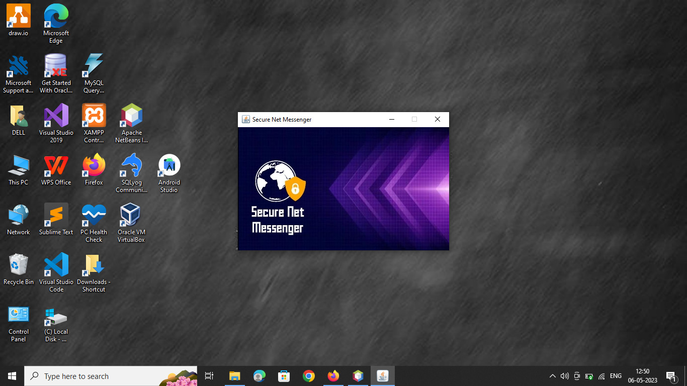
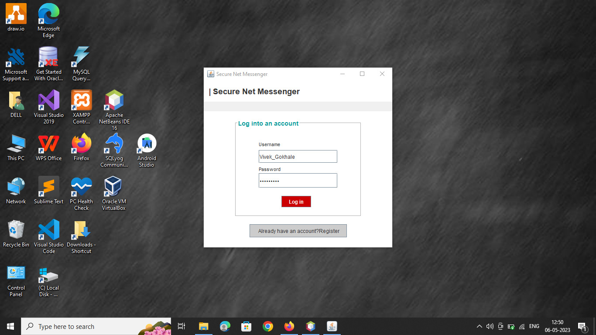
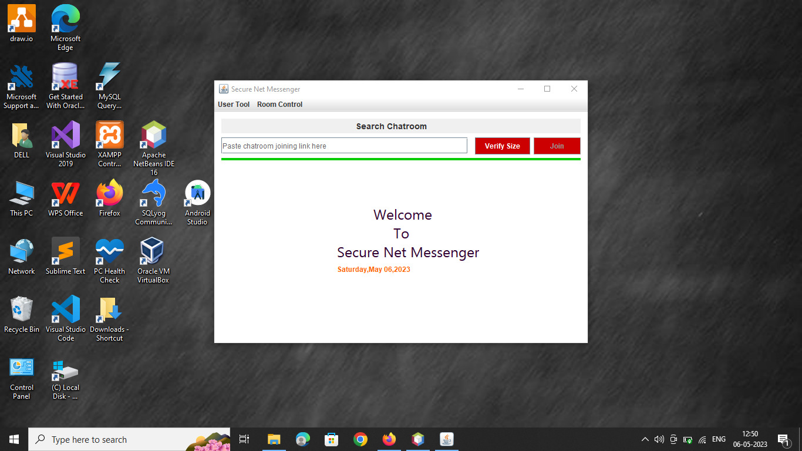
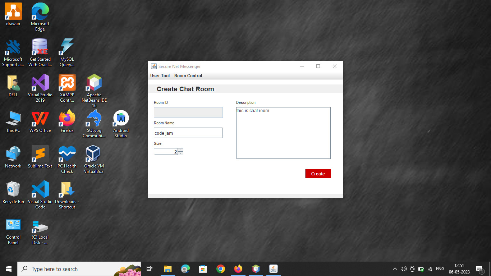
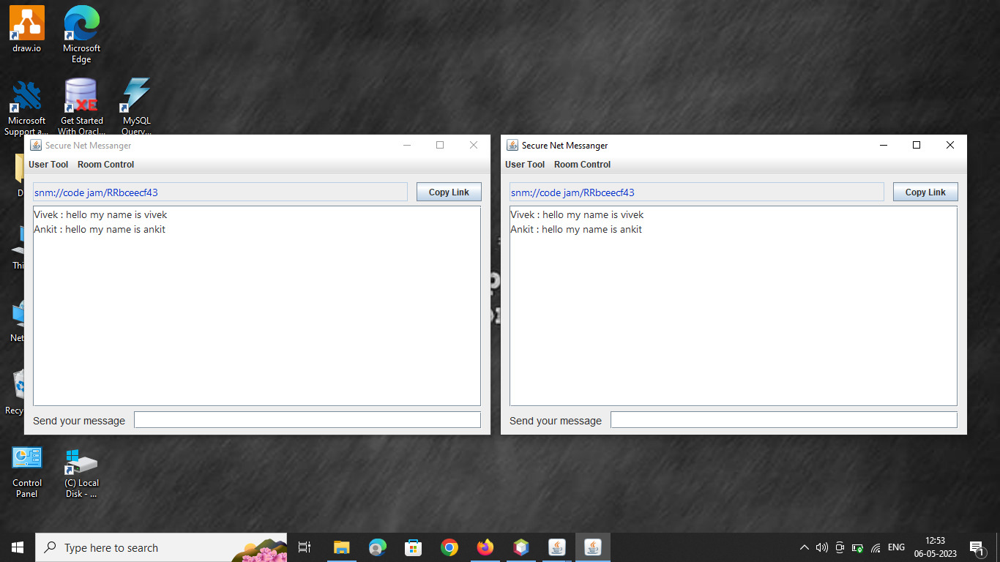
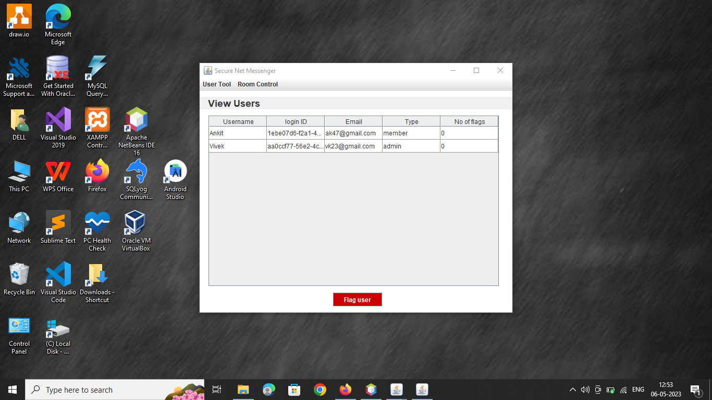
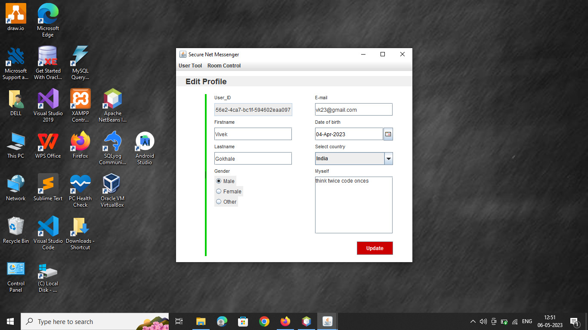
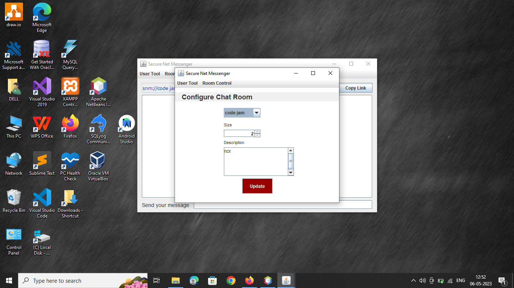
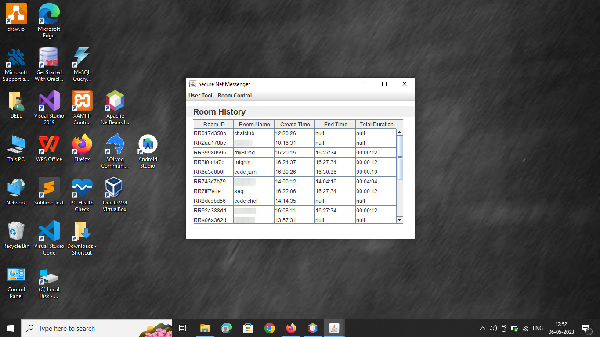

# NetMess

A basic learning project for LAN based chatting.
a lightweight LAN-based chat application for seamless communication in computer labs.

## Screenshots

- Splash Screen

- Authentication Window

- Welcome Screen

- Chatroom Creation Window

- Real-time Chatting Window

- Room Users Details

- Edit Profile Window

- Chat Room Configuration Window

- Room History

## Features
- Authentication
- Create Chat Room 
- Add New Users 
- View Currently Joined Users 
- Kick Users from Chatroom
- Update Chatroom Details
- Real-time Messaging
- Update Room and User Profile 
